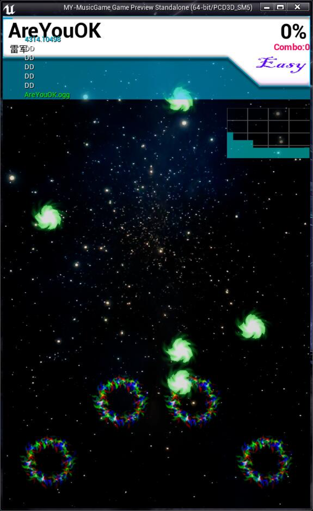
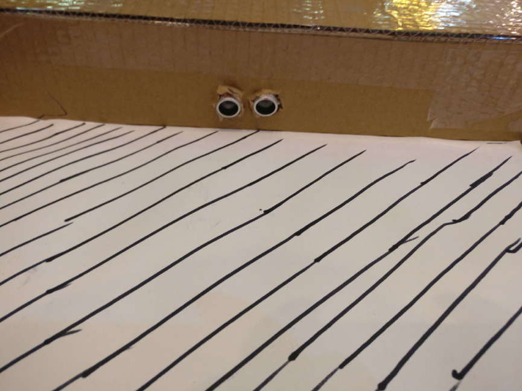

# 智能监控娱乐终端—项目设计文档

## 相关代码

代码目录结构：<br>


## 文字介绍

### 背景
运动是保持身体健康的最好方式，作为运动的形式之一，跳舞受到了广泛的欢迎，不论是蹦迪的青年，还是跳广场舞的老年人群，都是本项目的受众。
然而，由于受众经常不能充分了解自己运动量是否合适，他们的运动经常都是不健康的。
本项目考虑到受众身心健康，特制了Dance4me，可以根据用户心率自动调节舞步速度，同时结合利用大数据分析老年人身心健康程度，以及将自己的成绩、身心健康程度（呼吸率、心率等）分享至社交平台，借此提升用户健身热情，同时更加科学健身。

### 需求分析
一个适用于青年、中年、老年等各个年龄段的跳舞机。
智能跳舞机需要根据运动者的心率，自动调整跳舞节奏，防止跳舞速度过快，不利于正确健身。

### 开发进度安排
第一天：
- 10：00 ~ 12：00 上午确定开发需求，分工
- 15：00 ~ 17：00 前端、超声传感器、心率传感器等开发和测试
- 17：00 ~ 22：00 吃饭前交接
- 22：00 ~ 22：00 大部分功能
- 22：00 ~ 00：00 问题解决
- 00：00 ~ 03：00 多次调试

第二天：
- 08：00 ~ 10：00 封装界面、解说词
- 10：00 ~ 12：00 调优部件

### 技术实现
本项目主要涉及4个模块：
- 传感器检测踩踏效果、力度；
- 心率检测器传输心率数据；
- 后端socket控制游戏流程；
- 游戏展示界面。

### 数据格式
硬件->后端/心率->后端
```
data => {
    "data": {
        "cid": int 
    },
    "type": "hard/heart",
    "status": 1/-1
}
```

## 产品截图
 
### 启动界面

 
### 跳舞机游戏截图


### 游戏加分截图


### 游戏排名截图


### 分享界面

 
### 心率检测界面


## 硬件实物
 
### Dance4me实物图

 
### 超声波测距传感器图

 
### 树莓派节点数据采集

 
### 传感器节点内部走线


## 团队
团队成员来自5个不同学校，可谓是大江南北、五湖四海。
团队临时组队、临时思考idea，现场coding、现场提交code。


